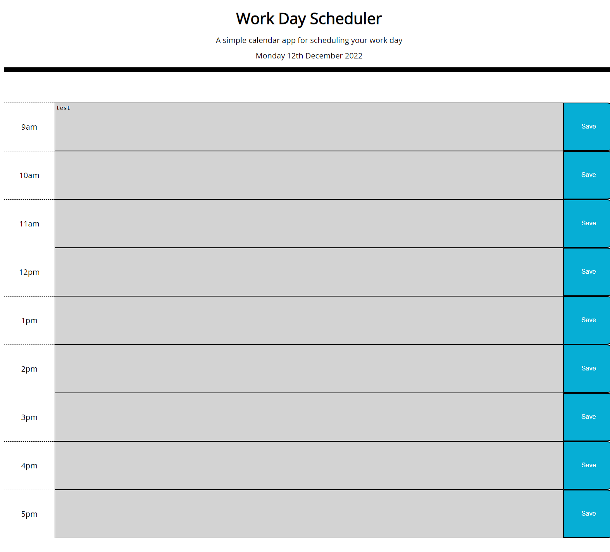

# Work Day Scheduler

## Description

I have created a simple calendar application that allows a user to save events for each hour of the day. The events will persist on browser refresh by storing the values in localStorage. The colour of the textarea elements update based on whether that time has passed, is current or is in the future.

I have used the following tools and methods to create this page:

* Moment.js to dynamically insert the current date - this dynamically updates each day
* While loop and JQuery to dynamically create HTML timeblocks with rows and nested divs, textareas and buttons
* CSS Flexbox and Grid to style and layout as desired
* For loop to iterate over ID values and compare value against current hour
* If statements to add classes to CSS ID selectors to change colour of text area background based on if textarea ID is equal to, greater than, or smaller than current hour.
* JQuery click function to add event listener to save button
* .click() event listener on save button saves the value within corresponding text area to localStorage
* JSON.stringiy and JSON.parse to turn array into a string when putting in local storage and fetch back as array

## Screenshot

## Links

Live application: https://zaitken1.github.io/work-scheduler/

GitHub repository: https://github.com/zaitken1/work-scheduler

